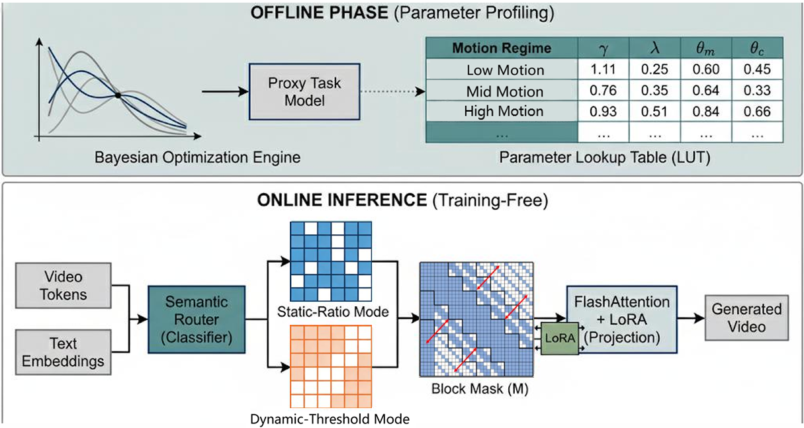
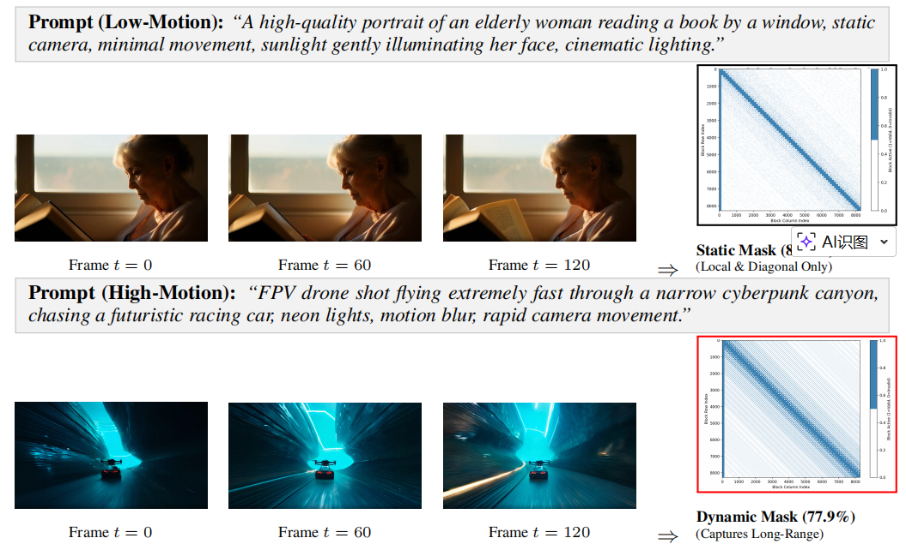
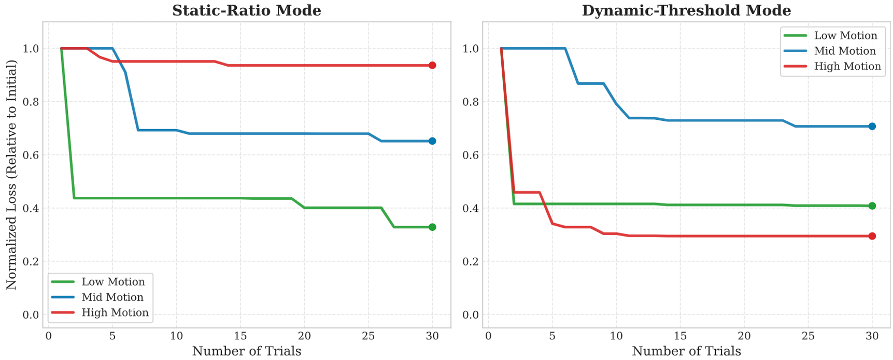
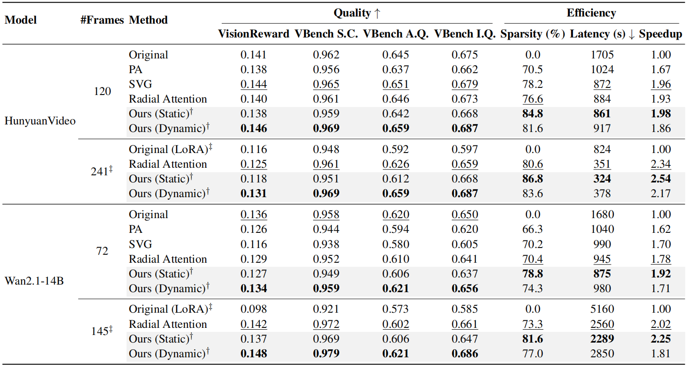

# 🚀 DynamicRad: Adaptive Spatiotemporal Sparsity for Long Video Diffusion

<div align="center">

[](#)
[](https://opensource.org/licenses/Apache-2.0)

**Anonymous Authors**

*Paper submitted for anonymous peer review.*

</div>

---

**DynamicRad** is a unified sparse-attention paradigm that reconciles kernel-friendly structure with content adaptivity for long video diffusion models (e.g., Wan2.1-14B and HunyuanVideo). By introducing an **Offline Bayesian Optimization (BO) pipeline** and a lightweight **Semantic Motion Router**, DynamicRad pushes the efficiency-quality Pareto frontier, achieving **1.7×–2.5× inference speedups** with **over 80% effective sparsity** on NVIDIA H100 GPUs, without the overhead of online neural architecture search.

---

## 🧠 Method Overview

<div align="center">
  
</div>

*DynamicRad combines offline BO-based configuration, prompt-conditioned motion routing, a shared structured candidate set with dual-mode sparse selection, and an optional mask-aware LoRA refinement module.*

---

## 🎬 Qualitative Adaptivity

<div align="center">
  
</div>

*DynamicRad automatically adapts its sparsity regime to the semantic motion implied by the prompt. For low-motion scenes, static-ratio mode produces highly sparse near-diagonal masks; for high-motion scenes, dynamic-threshold mode preserves long-range dependencies.*

---

## 🌟 News

- 🔥 Code and end-to-end inference scripts for **Wan2.1-14B** are released for anonymous peer review.
- 🔥 Offline BO profiling pipeline and plotting scripts are included for reproducibility.

---

## 🛠️ Installation & Environment Setup

DynamicRad is built on top of standard FlashAttention-2 and highly optimized sparse kernels.

### 1. Base Environment

```bash
conda create -n dynamicrad python=3.10 -y
conda activate dynamicrad
pip install torch==2.4.0 torchvision==0.19.0 torchaudio==0.15.2 --index-url https://download.pytorch.org/whl/cu121
```

### 2. Install Dependencies

```bash
# Clone the anonymous repository
git clone <anonymous_repo_link>
cd DynamicRad

# Install basic requirements
pip install -r requirements.txt
```

### 3. Install Core Attention Kernels

To achieve the reported speedups, DynamicRad relies on `flashinfer` and optionally `sageattention` depending on your hardware setup.

```bash
# Install FlashInfer (example for CUDA 12.1, Torch 2.4)
pip install flashinfer -i https://flashinfer.ai/whl/cu121/torch2.4

# Install SageAttention (optional but recommended for selected hardware architectures)
pip install sageattention==1.0.6
```

---

## 🚀 Quick Start (Inference)

We provide an end-to-end script to generate videos, visualize block-sparse masks, and run evaluation.

```bash
# Run the all-in-one pipeline
bash scripts/run_radial_vbench.sh
```

### Or run Python inference directly

```bash
python scripts/inference_wan.py \
    --model_id "Wan-AI/Wan2.1-T2V-14B-Diffusers" \
    --prompt "FPV drone shot flying through a futuristic sci-fi tunnel at high speed..." \
    --pattern "radial" \
    --topk_mode "dynamic_threshold" \
    --block_size 32 \
    --mask_threshold 0.8
```

---

## ⚙️ Offline Bayesian Optimization (BO) Pipeline

A core contribution of DynamicRad is the **Offline BO pipeline**, which models spatiotemporal energy decay using a physics-grounded proxy task based on AR feature drift. The profiling pipeline can be re-run for new resolutions or hardware in **under 15 minutes**.

```bash
# Run 30 trials of TPE optimization across Low, Mid, and High motion regimes
python dynamicrad/bo_pipeline/run_bo_pipeline.py --steps 30
```

This will automatically generate the lookup table used by the Semantic Motion Router, for example:

```text
final_bo_lookup_table_steps30.csv
```

### Visualizing BO Convergence

```bash
python scripts/plot_bo_convergence.py --steps 30
```

<div align="center">
  
</div>

*BO converges rapidly on the proxy task and produces motion-regime-specific configurations for Low, Mid, and High motion scenarios.*

---

## 📊 Main Results

DynamicRad achieves strong trade-offs between computational efficiency and generation quality, evaluated using **VisionReward** and **VBench** on **HunyuanVideo** and **Wan2.1-14B**.

<div align="center">
  
</div>

*DynamicRad achieves 1.7×–2.5× speedups with over 80% effective sparsity. Static-ratio mode provides the highest throughput, while dynamic-threshold mode preserves or even improves quality in some long-sequence settings.*

---

## 📂 Code Structure

```text
DynamicRad/
├── dynamicrad/
│   ├── attention/          # Core dual-mode sparse attention and mask generation
│   └── bo_pipeline/        # Offline BO proxy task and feature simulator
├── models/
│   └── wan2_1/             # Monkey-patching scripts for Wan2.1-14B
├── scripts/                # End-to-end inference and plotting scripts
├── configs/                # Pre-computed BO lookup tables (LUT)
├── assets/                 # README figures
└── README.md
```

---

## 🖼️ Suggested Asset Filenames

Place the following files under `assets/`:

```text
assets/framework_overview.png
assets/qualitative_adaptivity.png
assets/bo_convergence.png
assets/main_results.png
```

Recommended correspondence:

- `framework_overview.png` → paper figure `fig:framework`
- `qualitative_adaptivity.png` → paper figure `fig:qualitative_vis`
- `bo_convergence.png` → BO convergence figure
- `main_results.png` → paper table `tab:main_results` exported as an image

---

## 🙏 Acknowledgements

This project builds upon several open-source efforts. We thank the developers of Radial Attention, FlashInfer, and Wan2.1 for releasing code and infrastructure that made this anonymous evaluation possible.

---

## 📑 Citation

*Citation details and deanonymized authors will be updated after the conclusion of the double-blind review process.*
